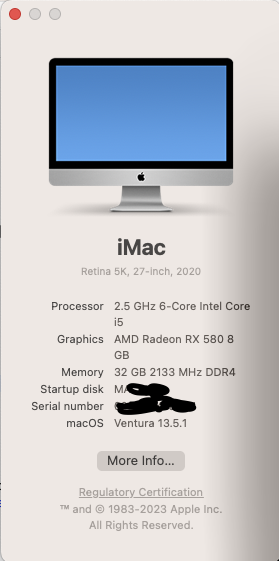

# Hackintosh [PRO-H610M-G-WIFI-DDR4](https://www.msi.com/Motherboard/PRO-H610M-G-WIFI-DDR4/Specification)

| Specifications | Detail                                                  |
| ------------------- | ------------------------------------------- |
| Motherbord | PRO H610M G WIFI DDR4 |
| Processor | Intel Core i5-12400 |
| Memory | 2*16GB DDR4 3200MHz |
| Hard Disk | SSD 512G |
| Graphics | AMD ARMOR RX 580 8GB |
| Config | OpenCore |

### Ventura

 

befor copy to your EFI. set PlatformInfo iMac20,2

##Good luck
